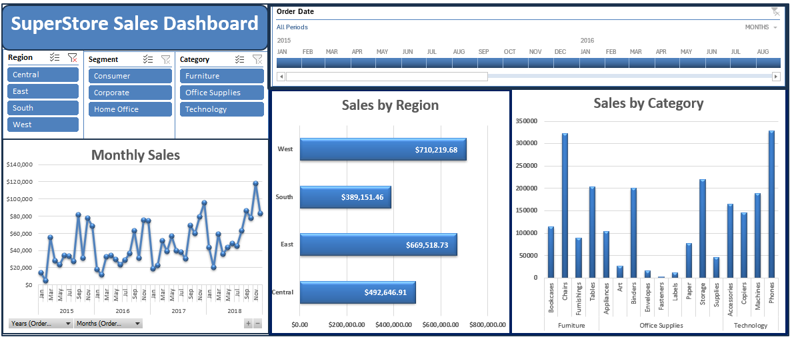

# 📊 Task 1: Excel Sales Performance Dashboard

This project is part of my internship under the **Sales Analysis Track**. It showcases how Excel can be used to create a clean and interactive **Sales Performance Dashboard** using real-world retail data.

---

## 🗂 Dataset

- **Source**: Superstore Sales Dataset (Kaggle)
- **File**: `Superstore Sales.csv`

---

## ⚒️ Tools Implemented

- Microsoft Excel 💻
- Pivot Tables 📈
- Slicers & Timelines ⏳
- Formulas & Formatting 📌

---

## 🧹 Data Cleaning Highlights

- Removed blank columns and unnecessary formatting.
- Corrected data types for `Order Date`, `Sales`, `Quantity`.
- Verified category labels and date formats.

---

## 📌 Dashboard Features

- **Pivot Charts**: Monthly revenue trends, category-wise sales, regional breakdown.
- **Timeline Slicer**: Filter sales by month or year.
- **Dynamic Interactivity** with slicers and timelines for better insights.

---

## 📷 Dashboard Preview

---

## 🧠 Key Skills Demonstrated

- Data organization and transformation in Excel.
- Building insightful dashboards using PivotTables and charts.
- Creating interactive filters with slicers and timelines.
- Communicating business metrics visually.

---

## 🤝 Let’s Connect

Made by **Maged Fouad** during Elevvo Internship.
Feel free to reach out on [LinkedIn](https://www.linkedin.com/in/mfouadmohamed325/) 💼

---
